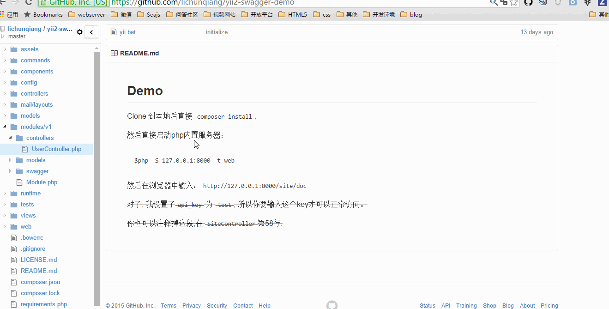

Demo
-----

Clone 到本地后直接 `composer install`.

然后直接启动php内置服务器：
```
$php -S 127.0.0.1:8000 -t web
```

然后在浏览器中输入：`http://127.0.0.1:8000`

~~对了, 我设置了`api_key` 为 `test`, 所以你要输入这个key才可以正常访问。~~

~~你也可以注释掉这段,在 `SiteController`第58行.~~

